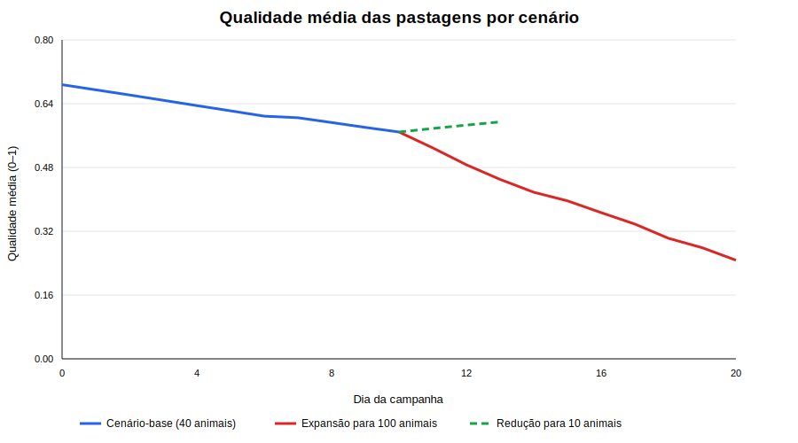
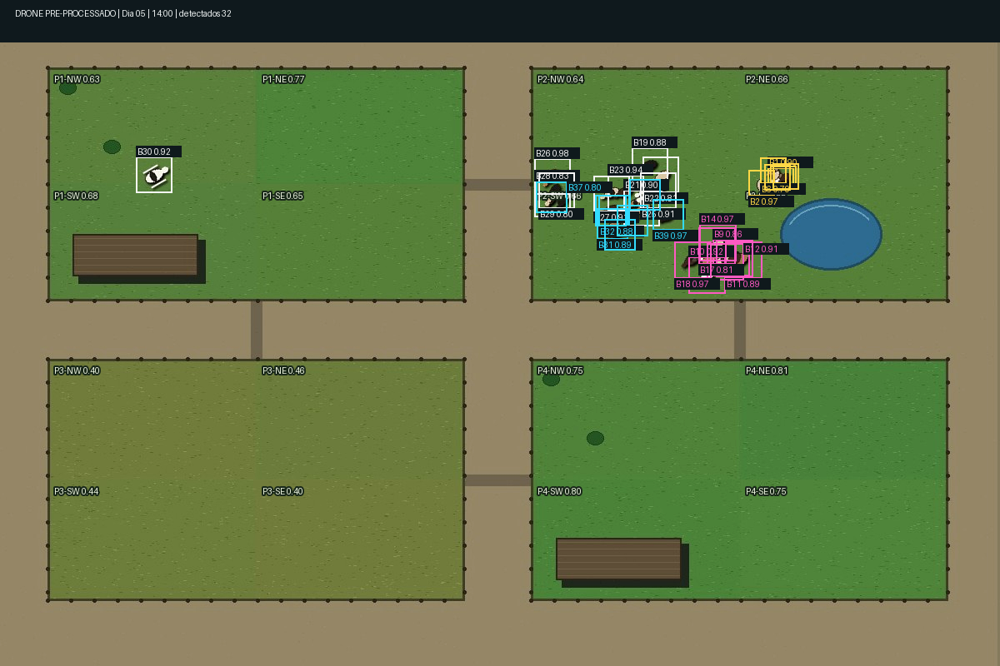
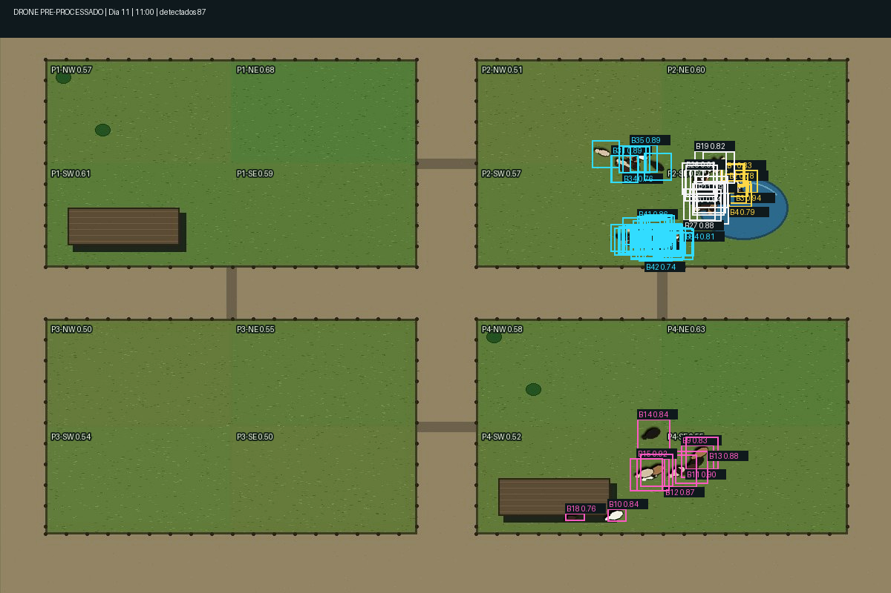
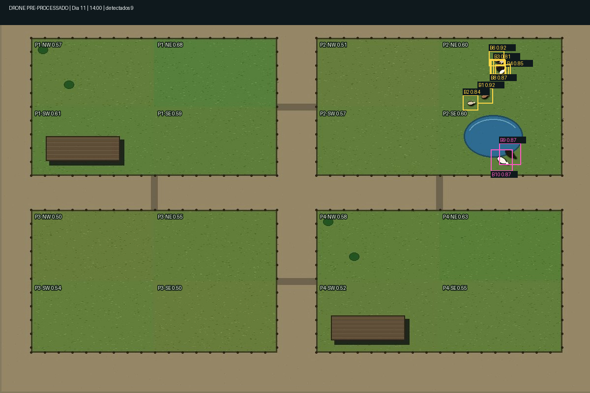
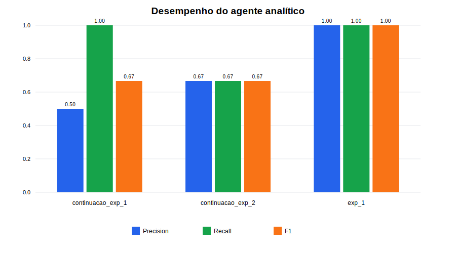

# 7. Resultados e Discussão

Este capítulo apresenta os resultados obtidos a partir dos três datasets disponíveis no ambiente experimental em 1º de julho de 2026: `exp_1`, `continuacao_exp_1` e `continuacao_exp_2`. O primeiro representa uma campanha-base com 40 bovinos durante 10 dias. Os dois seguintes são ramificações independentes do mesmo checkpoint final: uma expansão do rebanho para 100 animais por mais 10 dias e uma redução para 10 animais por mais 3 dias.

É importante distinguir **frames fisicamente gerados** de **frames avaliados nos datasets compostos**. A campanha-base gerou 120 frames, a expansão acrescentou 120 e a redução acrescentou 36, totalizando 276 frames originais. Como cada dataset composto preserva também os 120 frames do pai, as três avaliações processaram 516 observações de frame. Portanto, as métricas dos três datasets não constituem amostras estatisticamente independentes; elas representam avaliações de cenários que compartilham um histórico comum.

## 7.1 Validação do Ambiente Experimental

O ambiente-base foi configurado com quatro potreiros (`P1` a `P4`), uma fonte de água em `P2`, dois abrigos localizados em `P1` e `P4` e quatro conexões transitáveis. O rebanho inicial continha 40 animais, distribuídos em 8 terneiros, 10 vacas lactantes, 12 vacas adultas e 10 novilhas. Foram gerados 12 frames por dia, das 7h às 18h.

O pipeline de imagem incluiu imperfeições controladas para aproximar o dataset de uma captura aérea pré-processada: probabilidade-base de perda de detecção de 2,5%, deslocamento de localização de até 2 pixels, confiança entre 0,82 e 0,99, ruído de sensor, leve desfoque, jitter de câmera e oclusão total ou parcial sob os telhados. Animais totalmente cobertos pelo abrigo não são detectados; animais nas bordas podem aparecer parcialmente e com menor confiança.

**Tabela 1 – Integridade e cobertura dos datasets.**

| Dataset | Intervalo | Dias representados | Frames | Cobertura analítica | Tracks distintos | Máximo detectado/frame | Arquivos verificados | Falhas SHA-256 |
|---|---:|---:|---:|---:|---:|---:|---:|---:|
| `exp_1` | 1–120 | 10 | 120 | 100% | 40 | 40 | 363 | 0 |
| `continuacao_exp_1` | 1–240 | 20 | 240 | 100% | 100 | 93 | 724 | 0 |
| `continuacao_exp_2` | 1–156 | 13 | 156 | 100% | 40 | 40 | 472 | 0 |

Todos os frames esperados estavam presentes e os 1.559 artefatos registrados nos manifestos tiveram seus hashes SHA-256 recalculados sem divergências. Essa verificação confirma a integridade dos snapshots e a ausência de lacunas temporais. A separação entre `observable/` e `private/ground_truth` também foi preservada: o agente analítico processou somente imagens, bounding boxes, tracks, horário e clima, enquanto o avaliador abriu o ground truth posteriormente.

O comportamento ambiental apresentou continuidade e resposta ao uso. No cenário-base, `P1` iniciou com qualidade de pasto igual a 0,95 e caiu para 0,6128 ao final do décimo dia. Em sentido oposto, `P3`, inicialmente degradado, evoluiu de 0,35 para 0,5207. O planejador alterou o abrigo e o pastejo matinal de `P1` para `P4` no dia 7, evidenciando que a seleção de rota respondeu à degradação e à recuperação relativa dos potreiros, em vez de repetir uma trajetória fixa.

**Figura 1 – Evolução da qualidade média das pastagens.** A linha azul representa os dez dias compartilhados. Após o checkpoint, a expansão para 100 animais aumenta fortemente a pressão ambiental, enquanto a redução para 10 animais permite recuperação.

## 7.2 Avaliação dos Cenários Simulados

**Tabela 2 – Síntese dos cenários.**

| Cenário | Rebanho no segmento novo | Duração total | Mudança administrativa | Ocorrências relevantes | Qualidade média inicial → final | Resultado ambiental |
|---|---:|---:|---|---|---:|---|
| Base `exp_1` | 40 | 10 dias / 120 frames | Nenhuma | animal caído, frio extremo e desaparecimento | 0,6875 → 0,5688 | Degradação dos potreiros mais usados e recuperação de `P3` |
| Expansão `continuacao_exp_1` | 100 | 20 dias / 240 frames | Entrada de 60 novilhas no frame 121 | 3 quedas, 1 morte e 1 desaparecimento adicionais | 0,5688 → 0,2473 | Forte degradação por sobrecarga; 99 ativos e 1 morto ao final |
| Redução `continuacao_exp_2` | 10 | 13 dias / 156 frames | Venda de 30 animais no frame 121 | frio extremo e 1 morte adicionais | 0,5688 → 0,5943 | Recuperação geral; 9 ativos, 1 morto e 30 vendidos ao final |

No cenário-base, a qualidade média caiu 17,3% ao longo dos dez dias. A mudança para `P4` no sétimo dia evitou a concentração permanente em `P1` e permitiu que este potreiro voltasse a apresentar pequena recuperação nos dias finais. Dos 120 frames, 36 (30%) utilizaram formações espaciais aleatórias ou híbridas, incluindo grupo disperso, subgrupos exploradores, indivíduos desconexos e retorno disperso. Assim, a rotina diária foi mantida sem eliminar a variabilidade espacial.

O evento de animal caído pode ser observado no frame 56. O animal 30 aparece isolado em `P1`, enquanto a maior parte do rebanho está próxima à água em `P2`. A imagem mostra simultaneamente a ocorrência crítica e o comportamento normal do restante do grupo.

**Figura 2 – Evento `ANIMAL_CAIDO_DIA_5`, frame 56 (dia 5, 14h).** O animal 30 permanece isolado em `P1`; o pré-processamento registrou 32 detecções no frame.

Na primeira ramificação, 60 novilhas foram incorporadas no frame 121, elevando a população ativa de 40 para 100. O agente analítico ajustou sua referência visual gradualmente: alcançou estimativa de 86 animais no frame 122, 90 no frame 123, 97 no frame 124 e 99 no frame 125. Essa progressão é coerente com perdas temporárias de detecção e oclusões, e evita interpretar um único frame como inventário definitivo. O máximo observado em um frame foi 93 tracks, embora 100 identidades distintas tenham sido reconhecidas ao longo do dataset.

**Figura 3 – Cenário expandido no frame 125 (dia 11, 11h).** Foram detectados 87 animais, com elevada sobreposição de bounding boxes em `P2`, ilustrando o aumento de oclusões e da dificuldade analítica.

O aumento populacional provocou forte degradação ambiental. Entre os dias 10 e 20, a qualidade média caiu 56,5%. `P2`, utilizado para água e descanso, passou de 0,5689 para 0,0630; `P1` passou de 0,6128 para 0,1834. `P3` chegou a 0,6018 no dia 17 enquanto estava menos utilizado, mas caiu para 0,3804 após passar a integrar as rotas de pastejo nos dias finais. Isso demonstra que a seleção adaptativa de potreiros funciona, mas não é capaz de compensar indefinidamente uma lotação muito superior à capacidade ambiental.

Na segunda ramificação, a venda de 30 animais reduziu o rebanho físico para 10. Após a morte de um animal, o inventário final apresentou 9 ativos, 1 morto e 30 vendidos. A referência visual do agente caiu para 10 animais no frame 128, sem receber a informação administrativa da venda. Em três dias, a qualidade média aumentou 4,5%, passando de 0,5688 para 0,5943. `P1`, `P2` e `P3` apresentaram recuperação, enquanto `P4`, ainda utilizado como abrigo e pastejo matinal, permaneceu praticamente estável.

**Figura 4 – Cenário reduzido no frame 128 (dia 11, 14h).** O frame contém 9 detecções, com menor densidade espacial e menor sobreposição que o cenário expandido.

## 7.3 Avaliação do Agente Analítico

As métricas foram calculadas por episódio. Um verdadeiro positivo exige correspondência entre tipo de alerta, track do animal e sobreposição temporal com a ocorrência. Alertas sem ocorrência correspondente são falsos positivos; ocorrências sem alerta são falsos negativos.

**Tabela 3 – Desempenho analítico por dataset.**

| Dataset | Ocorrências | Alertas | TP | FP | FN | Precision | Recall | F1 | Atraso mediano |
|---|---:|---:|---:|---:|---:|---:|---:|---:|---:|
| `exp_1` | 2 | 2 | 2 | 0 | 0 | 1,0000 | 1,0000 | 1,0000 | 3,5 frames |
| `continuacao_exp_1` | 7 | 14 | 7 | 7 | 0 | 0,5000 | 1,0000 | 0,6667 | 4 frames |
| `continuacao_exp_2` | 3 | 3 | 2 | 1 | 1 | 0,6667 | 0,6667 | 0,6667 | 3,5 frames |

**Figura 5 – Precision, Recall e F1 por dataset.** O desempenho perfeito do cenário-base diminui quando são introduzidas maior densidade, mudanças populacionais e morte próxima ao final da janela.

No cenário-base, a queda do animal 30 foi detectada quatro frames após seu início, com confiança máxima de 0,79. O desaparecimento do animal 40 foi detectado após três frames, com confiança de 0,897. A ausência de FP e FN produziu métricas iguais a 1,00. Esse resultado confirma a capacidade das regras temporais em um cenário controlado, mas não deve ser interpretado isoladamente como evidência de generalização, pois o conjunto contém apenas duas ocorrências avaliáveis.

No cenário expandido, todas as sete ocorrências foram detectadas. As três novas quedas tiveram atraso de quatro frames; o novo desaparecimento teve atraso de três frames. A morte do animal 3 foi confirmada após 48 frames, exatamente a janela de observação prolongada usada pela regra de morte. Consequentemente, o atraso mediano permaneceu em quatro frames, mas a média subiu para dez. O Recall de 1,00 mostra que nenhuma ocorrência foi perdida.

Os sete falsos positivos da expansão foram todos alertas de `animal_missing`, associados aos tracks 46, 41, 81, 91, 68, 50 e 90. A queda da Precision para 0,50 está relacionada à maior densidade: em alguns momentos, animais recém-incorporados deixaram de ser observados por frames suficientes para gerar alerta, ainda que estivessem apenas ocluídos ou não detectados. A diferença entre 100 tracks distintos e máximo de 93 detecções simultâneas confirma esse mecanismo.

Na ramificação reduzida, a queda e o desaparecimento herdados do cenário-base permaneceram corretamente detectados. A morte do animal 1, iniciada no frame 130, não foi confirmada como morte até o encerramento no frame 156. Havia somente 27 frames disponíveis após o evento, enquanto a regra exige 48 frames de imobilidade e mudança visual. O agente produziu um alerta `animal_fallen` para o mesmo track, contabilizado como FP, e a morte permaneceu como FN. Portanto, o resultado expressa uma limitação de horizonte temporal: o dataset terminou antes que a regra pudesse reunir a evidência que ela própria exige.

## 7.4 Discussão dos Resultados

Os resultados sustentam quatro conclusões principais.

Primeiro, o simulador manteve coerência ambiental e comportamental ao longo de campanhas e ramificações. A degradação de `P1`, a recuperação de `P3` e a mudança do abrigo para `P4` evidenciam um ciclo de realimentação entre disponibilidade de pasto e decisão do rebanho. As ramificações conservaram o mesmo ambiente e checkpoint, permitindo comparar dois futuros contrafactuais: aumento e redução da lotação.

Segundo, a pressão ambiental respondeu de forma plausível ao tamanho do rebanho. A expansão para 100 animais reduziu a qualidade média para 0,2473, enquanto a redução para 10 elevou-a para 0,5943. Como ambos os cenários partem do mesmo estado no dia 10, a diferença não decorre de mapas ou condições iniciais diferentes. Ela decorre principalmente da alteração de lotação e das rotas escolhidas posteriormente. Esse resultado demonstra o valor do modelo como digital twin experimental simplificado.

Terceiro, o agente analítico mostrou boa sensibilidade temporal. O Recall foi 1,00 nos cenários base e expandido. Entretanto, a Precision foi sensível à densidade e à oclusão. Esse comportamento é esperado em uma solução baseada em tracks: quanto maior a população e a sobreposição visual, maior a chance de uma ausência temporária parecer desaparecimento. A adaptação populacional mitigou o problema ao incorporar entradas e retiradas persistentes sem consultar eventos administrativos, mas ainda há espaço para incluir qualidade global do frame, proximidade de abrigos e consistência espacial antes de gerar um alerta de ausência.

Quarto, morte e queda continuam sendo as classes mais difíceis de separar. Ambas começam com imobilidade. A morte exige evidência temporal e visual mais longa, enquanto a queda precisa ser comunicada rapidamente. Reduzir excessivamente a janela de morte aumenta falsas mortes; aumentá-la produz atraso e pode gerar alertas provisórios de queda. Uma evolução adequada seria adotar estados progressivos — “imobilidade suspeita”, “animal caído” e “possível morte” — ou um classificador visual específico para postura corporal e decomposição. No presente trabalho, essa confusão deve ser apresentada como limitação conhecida e mensurada, não como falha escondida.

Também devem ser reconhecidas limitações externas: as imagens são sintéticas; os IDs de tracking são fornecidos pelo pipeline simulado; as regras foram avaliadas nos mesmos tipos de ocorrência usados para desenhar o experimento; e os três datasets compartilham os primeiros 120 frames. Assim, as métricas demonstram consistência interna e viabilidade do método, mas não substituem validação com imagens reais de drone, múltiplas sementes, diferentes mapas, diferentes lotações e comparação com anotação de especialistas.

Em síntese, o protótipo atingiu o objetivo de produzir datasets controlados, continuáveis e auditáveis, preservando a independência entre simulação, inferência e avaliação. O cenário-base confirmou o funcionamento ponta a ponta; as ramificações demonstraram capacidade de representar mudanças administrativas e ambientais; e os resultados analíticos revelaram, de forma rastreável, tanto os acertos quanto os limites do modelo sob aumento de complexidade.

## Rastreabilidade dos resultados

- Métricas: `data/analysis_runs/{dataset}/{run_id}/evaluation.json`.
- Histórico populacional: `data/analysis_runs/{dataset}/{run_id}/population_history.json`.
- Integridade: `data/datasets/{dataset}/provenance/checksums.json`.
- Linhagem: `data/datasets/continuacao_exp_*/provenance/lineage.json`.
- Dinâmica ambiental: `data/users/web/campaigns/{campaign}/day_summaries/`.
- Dados tabulares desta síntese: `assets/metricas_analiticas.csv` e `assets/resumo_numerico.json`.
